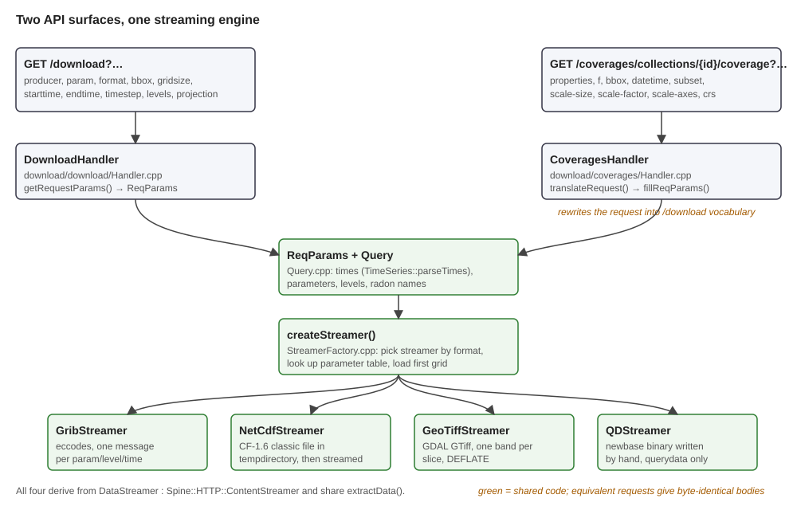
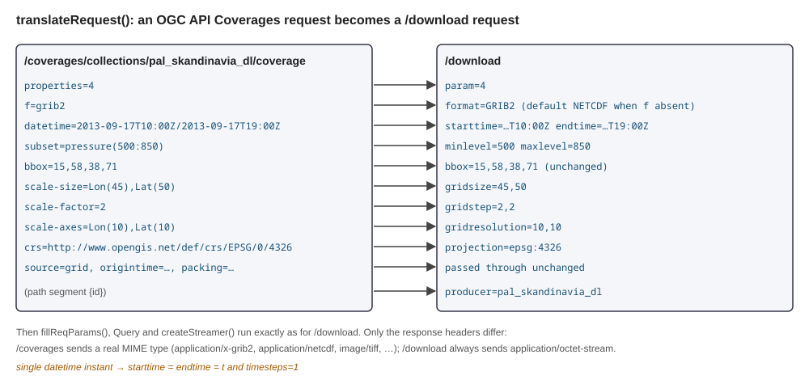
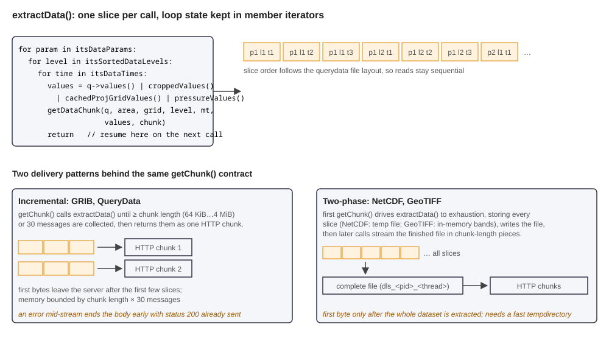
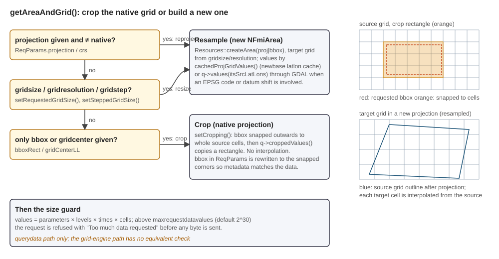

# Download plugin: a programmer's tutorial

This tutorial explains how a request to the Download plugin becomes a GRIB, NetCDF,
GeoTIFF or QueryData file on the wire, and how the OGC API Coverages interface is layered
on the same machinery. It is written for programmers who are about to add a parameter
mapping, a request option, an output format, or who need to debug why a download looks
the way it does. It complements [README.md](../README.md), which documents every request
option, and [ogc-api-coverages.md](ogc-api-coverages.md), which documents the OGC
surface.

The plugin produces no pictures, so the figures here are diagrams of the code paths.
Their SVG sources are next to the PNGs in `docs/images/tutorial/` and can be edited.

All file paths are relative to the plugin root. The example request used throughout is
the test `grb2_pal-skd-dl_many_tsteps_gsize_bbox`, which exists in both API flavours:

```
GET /download?param=4&producer=pal_skandinavia_dl&format=grib2&starttime=20130917T1000&timesteps=4&gridsize=45,50&bbox=15,58,38,71
GET /coverages/collections/pal_skandinavia_dl/coverage?properties=4&f=grib2&starttime=20130917T1000&timesteps=4&scale-size=Lon(45),Lat(50)&bbox=15,58,38,71
```

| Role | Path |
|------|------|
| Legacy request | `test/input/grb2_pal-skd-dl_many_tsteps_gsize_bbox.get` |
| OGC request | `test/input-coverages/grb2_pal-skd-dl_many_tsteps_gsize_bbox.get` |
| Expected output (text dump of the GRIB) | `test/output/grb2_pal-skd-dl_many_tsteps_gsize_bbox.get` |
| Parameter tables | `cnf/grib.json`, `cnf/netcdf.json` |
| Test configuration | `test/cnf/download.conf`, `test/cnf/querydata.conf` |

## Contents

1. [The pipeline in one picture](#1-the-pipeline-in-one-picture)
2. [Two request vocabularies, one ReqParams](#2-two-request-vocabularies-one-reqparams)
3. [From parameters to a Query](#3-from-parameters-to-a-query)
4. [The streamer factory](#4-the-streamer-factory)
5. [DataStreamer: the extraction loop](#5-datastreamer-the-extraction-loop)
6. [Geometry: crop, resample, reproject](#6-geometry-crop-resample-reproject)
7. [Two delivery patterns behind one interface](#7-two-delivery-patterns-behind-one-interface)
8. [Format encoders](#8-format-encoders)
9. [Parameter mapping tables](#9-parameter-mapping-tables)
10. [The grid engine path](#10-the-grid-engine-path)
11. [OGC API Coverages: what is and is not there](#11-ogc-api-coverages-what-is-and-is-not-there)
12. [Configuration](#12-configuration)
13. [Caching, limits and failure modes](#13-caching-limits-and-failure-modes)
14. [Tests](#14-tests)
15. [Extending the plugin](#15-extending-the-plugin)
16. [Gotchas](#16-gotchas)

---

## 1. The pipeline in one picture



`Plugin::init` in `download/Plugin.cpp` obtains the Querydata, Grid and Geonames engines
and registers two content handlers. `/download` is an exact-path handler served by
`DownloadHandler`. `/coverages` is registered as a URI prefix handler, so every path
under it reaches `CoveragesHandler`, which routes metadata endpoints itself and rewrites
coverage requests into `/download` vocabulary. From that point on both share everything:
the `ReqParams` and `Query` objects, `createStreamer`, the `DataStreamer` base class
and the four concrete encoders. Equivalent requests on the two endpoints produce
byte-identical bodies; the test suite proves it by running the same expected outputs
against both request directories.

The plugin holds no state between requests and caches no results. Every request
re-extracts data from the engines and streams it out in HTTP chunks.

---

## 2. Two request vocabularies, one ReqParams

### 2.1 `/download`

`DownloadHandler::getRequestParams` in `download/download/Handler.cpp` reads the legacy
options into a `ReqParams` struct (`download/Query.h`). The important groups are:

| Group | Options | Notes |
|---|---|---|
| Source and producer | `source`, `producer` or `model`, `geometryid` | `source` is `querydata` (default), `grid` or `gridcontent`, or `gridmapping`. With grid content the producer is embedded in the parameter names. |
| Time | `starttime`, `endtime`, `timestep`, `timesteps`, `origintime`, `now`, `tz` | The literal `data` means "from the data". `origintime` accepts `latest`, `newest`, `oldest` or a timestamp. |
| Levels | `level`, `levels`, `minlevel`, `maxlevel` | Querydata only. Grid content encodes the level in the parameter name. |
| Geometry | `projection`, `bbox`, `gridcenter`, `gridsize`, `gridresolution`, `gridstep`, `datum` | `bbox` and `gridcenter` are exclusive, as are `gridsize` and `gridresolution`. |
| Format | `format`, `packing`, `bitspervalue`, `tablesversion` | `grib1`, `grib2`, `netcdf`, `geotiff` (also `gtiff`, `tiff`), `qd`. Packing options apply to GRIB only and must be given together. |
| Tuning | `gridparamblocksize`, `gridtimeblocksize`, `chunksize` | Grid content only. |

Every option is read through helpers that consult the producer's
`disabledReqParameters` list from the configuration. A disabled option is not an error;
it silently yields its default. This is how a deployment can, for example, forbid `qd`
output for a producer.

### 2.2 `/coverages/.../coverage`

`CoveragesHandler::handleCoverage` in `download/coverages/Handler.cpp` does not parse
OGC parameters into `ReqParams` directly. It copies the HTTP request and rewrites it:



`translateRequest` is short enough to read in full. The collection id becomes
`producer`. `properties` becomes `param`. `f` is mapped through `mapOutputFormat`, which
accepts both MIME types and short names, and defaults to NetCDF when absent. `datetime`
is split into `starttime` and `endtime`, with a single instant also setting
`timesteps=1`. `subset=axis(lo:hi)` becomes `minlevel`/`maxlevel` or
`starttime`/`endtime` depending on the axis name. `crs` goes through `crsToProjection`,
which turns OGC CRS URIs and EPSG codes into `epsg:n`, treats CRS84 as EPSG:4326, and
converts a GDAL description that matches a newbase projection into the equivalent
newbase string so that output is identical to the legacy API. `scale-size`,
`scale-factor` and `scale-axes` become `gridsize`, `gridstep` and `gridresolution`.
Anything the OGC vocabulary lacks, such as `source`, `origintime` or `packing`, passes
through unchanged.

The rewritten request then goes through `fillReqParams`, a simplified sibling of
`getRequestParams`, and from there the path is common. Two differences remain at the
HTTP level: `/coverages` sets a real `Content-Type` per format while `/download` always
sends `application/octet-stream`, and `fillReqParams` does not consult the per-producer
disabled-parameter lists.

---

## 3. From parameters to a Query

`Query` in `download/Query.cpp` is constructed from the request after `ReqParams` and
runs three parsers.

**Times.** `parseTimeOptions` delegates to `TimeSeries::parseTimes` from the
timeseries library, so `starttime`, `endtime`, `timestep`, `timesteps`, `now` and `tz`
follow the same rules as the TimeSeries plugin, with one deliberate deviation: the
default time zone is UTC, so a timestamp without an offset is UTC. The flags
`startTimeData` and `endTimeData` remember whether the ends were left to the data.

**Parameters.** For querydata sources this is `TimeSeries::OptionParsers::parseParameters`,
so newbase names (`Temperature`) and numeric ids (`4`) both work. For grid sources the
parser understands the radon parameter grammar

```
<param>:<producer>:<geometryId>:<levelTypeId>:<level>:<forecastType>[:<forecastNumber>]
```

where the level and forecast-number fields may hold lists and ranges such as
`1;5-8;11`. Ranges are expanded by asking the content server which levels or members
actually exist for the chosen analysis time, and each hit becomes a separate
`Spine::Parameter`. Function parameters written as `/avg{...} as NAME:...` are
recognised and kept aside in `functionParameters`. The analysis time itself is chosen by
`loadOriginTimeGenerations`, which finds the latest generation common to all producers
named in the parameters unless `origintime` fixed it.

**Levels.** `parseLevels` collects `level` and `levels` into a set. It refuses them for
grid sources, where the level lives in the parameter name.

---

## 4. The streamer factory

`createStreamer` in `download/StreamerFactory.cpp` is the shared entry point after
parsing:

```cpp
if (outputFormat == Grib1 || outputFormat == Grib2)
  ds = new GribStreamer(...);      getParamConfig(config.getParamChangeTable(), ...);       // grib.json
else if (outputFormat == NetCdf || outputFormat == GeoTiff)
  ds = NetCdf ? new NetCdfStreamer(...) : new GeoTiffStreamer(...);
                                   getParamConfig(config.getParamChangeTable(false), ...);  // netcdf.json
else
  ds = new QDStreamer(...);        // QueryData needs no mapping table
```

`getParamConfig` walks the requested parameters, looks each one up in the relevant
table (section 9), records its scale and offset, and **drops parameters it cannot find**.
If nothing remains the request fails with "No known parameters available". Note that
GeoTIFF shares the NetCDF table, including its unit conversions.

The factory then wires the engines into the streamer, fetches the querydata object for
the producer and origin time, generates the list of valid times
(`generateValidTimeList`, the only place the Geonames engine is used, for the time
zone), sets the level list, and finally calls `hasRequestedData`. That call loads the
**first grid**. It exists so that "no data" becomes a clean 400 before the response
status is committed; once streaming has begun, errors can no longer change the status
(section 13). The download filename is composed from producer, origin time, time range
and projection.

---

## 5. DataStreamer: the extraction loop

`DataStreamer` in `download/DataStreamer.h` derives from `Spine::HTTP::ContentStreamer`.
The server pulls the response by calling `getChunk()` repeatedly; an empty string means
end of data, and `setStatus` reports success or failure. Everything format-specific is
behind four virtuals:

| Virtual | Role |
|---|---|
| `getChunk()` | server-facing pull; each encoder implements its own delivery pattern (section 7) |
| `getDataChunk(q, area, grid, level, time, values, chunk)` | encode one querydata slice |
| `getGridDataChunk(gridQuery, level, time, chunk)` | encode one grid-engine slice |
| `paramChanged()` | hook for encoders that keep per-parameter state, used by NetCDF |

The shared engine is `extractData`:



The loop order is parameter, then level, then time, deliberately matching the layout of
a querydata file so that reads stay sequential. The loop variables are members
(`itsParamIterator`, `itsLevelIterator`, `itsTimeIterator`), and the function returns
after producing exactly one slice, so the next call resumes where the previous one
stopped. Skipped times and unavailable levels are stepped over. For non-multifile
querydata, `getCurrentParamQ` first copies the current parameter (and its U/V partner
for wind components) into a small in-memory querydata so that iterating times and
levels does not page through the whole file.

Which fetch method is used depends on geometry and level:

| Situation | Call |
|---|---|
| native grid, exact level and time | `q->values()` or `q->croppedValues()` |
| new grid or interpolated time, newbase projections | `cachedProjGridValues()` with a latlon cache; U and V are rotated to the target grid's north |
| interpolated pressure level | `q->pressureValues()` (only if the producer allows `verticalInterpolation`) |
| EPSG code or datum shift | `q->values(itsSrcLatLons, ...)` where the target cell coordinates were transformed to source latlons with GDAL |

For grid sources `extractData` delegates to `extractGridData` (section 10).

---

## 6. Geometry: crop, resample, reproject



`getAreaAndGrid` runs once per request. The questions it answers, in order:

1. **Is a projection requested that differs from the data's?** Then a new `NFmiArea` is
   built through `Resources::createArea` from the projection string and bounding box,
   and every output cell is interpolated. Newbase projection strings stay inside
   newbase; EPSG codes and datum shifts (`Datum.cpp`) go through GDAL coordinate
   transformations owned by `Resources`.
2. **Is a grid size requested?** `setRequestedGridSize` derives the target size from
   `gridsize` directly or from `gridresolution` in kilometres; `setSteppedGridSize`
   then divides by `gridstep`, rounding up and requiring at least two cells per axis.
3. **Is only a bounding box or centre requested on the native projection?** Then
   `setCropping` snaps the box outwards to whole source cells, records the cell
   rectangle, and rewrites the bounding box in `ReqParams` to the snapped corners so
   that the metadata written into the file matches the data. `gridcenter=lon,lat,w,h`
   builds the box from a centre and half-widths in kilometres.

Cropping copies values without interpolation and is therefore both faster and exact.
Resampling interpolates, and it is the only option when the projection changes.

After the grid is known the size guard runs: parameters × levels × times × cells must
not exceed `maxrequestdatavalues`, a configuration value defaulting to 2^30. Oversize
requests are refused with "Too much data requested" before any byte is sent. The check
lives on the querydata path only.

---

## 7. Two delivery patterns behind one interface

All four encoders implement `getChunk`, but they fall into two patterns.

**Incremental: GRIB and QueryData.** `GribStreamer::getChunk` calls `extractData` in a
loop, encoding each slice into one GRIB message, and returns when either the
accumulated bytes reach the chunk length (64 KiB by default for grid sources, 4 MiB for
querydata, capped at 4 MiB) or 30 messages have been collected. The first bytes leave
the server after a handful of slices, and memory use is bounded by chunk length times
message count. `QDStreamer::getChunk` writes the newbase header, then streams parameter
by parameter in querydata value order.

**Two-phase: NetCDF and GeoTIFF.** These formats need the whole dataset before the file
header can be written, so the first `getChunk` drives `extractData` to exhaustion and
stores every slice: NetCDF into a temporary file under `tempdirectory`
(`dls_<pid>_<thread>`), GeoTIFF into an in-memory vector of bands. The file is then
written and closed, and subsequent `getChunk` calls read it back in chunk-length pieces.
The first byte reaches the client only after the full extraction, and the temporary
directory should be fast storage.

The pattern difference matters for error handling. Both catch exceptions inside
`getChunk`, log the stack trace, set `EXIT_ERROR` and return an empty chunk. Since the
200 status and headers were already sent, the client sees a truncated body, not an
error. This is why `hasRequestedData` in the factory loads the first grid up front.

---

## 8. Format encoders

### 8.1 GRIB (`download/GribStreamer.cpp`)

One eccodes handle is created from the `GRIB1` or `GRIB2` sample and reused for every
message. Per slice, `addValuesToGrib`:

1. applies the producer's named GRIB settings from configuration;
2. sets the origin time, adjusted backwards to an even data timestep, so that steps are
   expressed as offsets from it;
3. sets level and parameter keys via `setLevelAndParameterToGrib`, which looks the
   newbase id (or radon name) up in the GRIB table and writes either `paramId` or the
   edition-specific `table2Version`/`indicatorOfParameter` or
   `discipline`/`parameterCategory`/`parameterNumber`, plus `typeOfLevel`;
4. sets `startStep`/`endStep` and the statistical processing type for accumulated or
   averaged parameters;
5. copies the values applying `(value + offset) / scale` and writing `9999` for missing
   data with a bitmap;
6. sets `bitsPerValue` and `packingType` **after** the values, an eccodes ordering
   quirk, and, as a further workaround, encodes the very first message twice when a
   packing type was requested.

Geometry keys are written per projection class (`setLatlonGeometryToGrib`,
`setRotatedLatlonGeometryToGrib`, `setStereographicGeometryToGrib`,
`setMercatorGeometryToGrib`, `setLambertConformalGeometryToGrib`); YKJ and a few others
cannot be expressed in GRIB and throw. `setShapeOfTheEarth` derives the ellipsoid code
from the target spatial reference. `grib_get_message` yields the bytes for the chunk.

### 8.2 NetCDF (`download/NetCdfStreamer.cpp`)

The file is created with `NcFile::classic64`, so the output is classic-format NetCDF
with 64-bit offsets rather than NetCDF-4/HDF5, and no compression is applied. Global
attributes declare `Conventions = CF-1.6`. Dimensions are `time` (integer offsets since
the first time, unit chosen from the timestep), an optional level dimension per level
type, an optional ensemble dimension for grid ensembles, and either `lat`/`lon` for
geographic output or `y`/`x` with two-dimensional auxiliary `lat(y,x)`/`lon(y,x)`
variables for projected output, following CF section 5.2. A `crs` variable carries the
`grid_mapping` attributes for latlon, rotated latlon, polar stereographic, Mercator,
Lambert conformal and YKJ. Data variables are named `<name>_<newbaseid>`, typed float,
with `units`, `_FillValue`, `standard_name`, `long_name` and `cell_methods` taken from
the NetCDF table. `storeParamValues` is called per slice from `getChunk`, and
`paramChanged` advances the variable iterator.

### 8.3 GeoTIFF (`download/GeoTiffStreamer.cpp`)

Each slice becomes one band. `captureGeometry` computes the geotransform from the cell
centres of the first slice and the projection WKT from the target spatial reference,
EPSG:2393 for YKJ, or the area's own WKT. `writeFile` creates a `GTiff` dataset with
`GDT_Float32`, `COMPRESS=DEFLATE` and `PREDICTOR=3`, writes per-band `NoData`, a
description of the form `<param> [level=N] <time>` and `PARAMETER`, `TIME`, `LEVEL`
metadata items. GDAL calls are serialised with a global mutex. The whole dataset is
held in memory until written.

### 8.4 QueryData (`download/QueryDataStreamer.cpp`)

The newbase binary format is written by hand: the `NFmiQueryInfo` header, the float
type marker, the binary flag and total size, then raw values in querydata order.
`DataStreamer::createQD` builds the descriptor from the target grid, levels and times.
QueryData output is available only for the querydata source and not with `gridstep`.

---

## 9. Parameter mapping tables

GRIB and NetCDF cannot use newbase parameter ids, so two JSON tables translate. They are
arrays of objects parsed by `readParamConfig` in `download/ParamConfig.cpp` into a
`ParamChangeTable` of `ParamChangeItem` structs. Comments are allowed in the files.

`cnf/grib.json`, two entries for temperature:

```json
{ "gribid": 167, "newbaseid": 4, "name": "2t", "offset": 273.15,
  "leveltype": "heightAboveGround", "levelvalue": 2 },
{ "gribid": 130, "newbaseid": 4, "name": "t",  "offset": 273.15 }
```

The first is preferred for surface data (it has a level), the second for pressure or
hybrid data (it has none); `setLevelAndParameterToGrib` makes that choice. Grid sources
are matched on `radonname` (and optionally `radonproducer`) and carry explicit
`grib1`/`grib2` blocks:

```json
{ "radonname": "T-K", "grib1": { "table2version": 1, "parameternumber": 11 } }
```

`cnf/netcdf.json` maps the same newbase id to CF metadata:

```json
{ "newbaseid": 4, "name": "air_temperature", "standardname": "air_temperature",
  "longname": "Air temperature", "offset": 273.15, "unit": "K" }
```

`offset` and `divisor` are applied as `(value + offset) / divisor`, which is how
Celsius querydata becomes Kelvin output. Optional `aggregatetype` and `aggregatelength`
drive GRIB step types and NetCDF `cell_methods`; `gridrelative` marks U/V variants.
Lookups are linear scans at request time. Unknown keys in the files throw at startup,
which is the cheapest place to catch a typo.

Adding a parameter is therefore a JSON edit in one or both tables. No C++ changes are
needed unless the parameter requires a new level type or a new GRIB template.

---

## 10. The grid engine path

With `source=grid` (or `gridcontent`, `gridmapping`) the querydata engine is not used.
`hasRequestedGridData` collects per-parameter metadata (geometries, levels, origin
times, valid times) from the content server, selects the latest common origin time,
generates the time list and sets up levels. `extractGridData` then builds a
`QueryServer::Query` in `buildGridQuery` per slice with attributes such as `grid.llbox`
or `grid.bbox`, `grid.width`/`grid.height`, `grid.crs` (which can be `data`, `crop`, a
geometry id or the user projection) and a `TimeSteps` search over the wanted forecast
times, and calls `executeQuery`. `getGridQueryInfo` validates the returned grid size and
reads back the actual CRS and bounding box for the encoders.

`gridparamblocksize` and `gridtimeblocksize` let one query fetch several parameters or
time steps at once; the result buffer is then sliced locally (`bufferIndex`). The
encoders receive slices through `getGridDataChunk` instead of `getDataChunk`. `buildGridQuery` checks the
requested grid size (`gridsize`, or a size derived from `gridresolution`) against
`maxrequestdatavalues`. The table-driven unit conversion is not applied to grid content, which is
assumed to be in the target units already.

### 10.1 The three grid source modes

`download/Handler.cpp` maps `source` to `ReqParams::dataSource`:

| `source` | `dataSource` | Parameter names | Producer |
|---|---|---|---|
| `querydata` (default) | `QueryData` | newbase names or numbers | `producer` / `model` |
| `gridmapping` | `GridMapping` | newbase names, resolved through the grid engine's parameter mappings | `producer` / `model` |
| `grid`, `gridcontent` | `GridContent` | Radon-style names `param:producer:geometryId:levelTypeId:level:forecastType[:forecastNumber]` (`Query::parseRadonParameterName`) | taken from the parameter names; `producer`, `model`, `level` and `levels` are rejected |

For `GridContent`, `Query::parseParameters` loads the generations of every named
producer from the content server (`getGenerationInfoListByProducerName`), picks the
latest origin time common to all parameters (unless `origintime` is given), and expands
level and forecast-number ranges (`1;5-8;11`) by looking at the content records that
actually exist (`getContentListByParameterAndGenerationId`). A request for which no
common generation exists fails with `No data available`.

The grid engine must be loaded and enabled for both grid modes, otherwise the request
fails with `Grid data is not available` or `Grid data is disabled`.

### 10.2 Geometry of the output

`getGridQueryInfo` and the related `getGrid*` helpers read back what the Data Server
produced: the actual CRS (`grid.crs`), `grid.bbox` / `grid.llbox` / `grid.crop.llbox`,
the size and cell size, and the original grid's properties (`grid.original.crs`,
`grid.original.reverseXDirection` / `reverseYDirection`, `grid.original.relativeUV`). The GRIB and NetCDF encoders
build the output grid definition from these values, so the encoder trusts grid-files to
report the latitudes in the same order as the returned rows. grid-files has a regression
test for exactly this (`FastPathOrientationTest`): a mismatch produces vertically flipped
fields. When changing the orientation handling on either side, test a north-to-south
stored input (for example ECMWF) with and without reprojection.

For a projected output CRS, `buildGridQuery` sends the extent as projected `grid.bbox`
(metres), transforming a user-given lat/lon `bbox` first (`getGridBBoxFromUserBBox`);
sending `grid.llbox` for a projected target would make the server read degrees as
metres.

---

## 11. OGC API Coverages: what is and is not there

`CoveragesHandler::requestHandler` splits the path and dispatches:

| Path | Handler | Content |
|---|---|---|
| `/coverages` | `handleLandingPage` | links to conformance and collections |
| `/coverages/conformance` | `handleConformance` | OGC API Common core and collections; Coverages core, subsetting, field selection, scaling, CRS |
| `/coverages/collections` | `handleCollections` | one entry per configured producer |
| `/coverages/collections/{id}` | `handleCollection` | links, output formats, CRS list |
| `/coverages/collections/{id}/schema` | `handleSchema` | JSON Schema of fields from the parameter tables |
| `/coverages/collections/{id}/coverage` | `handleCoverage` | the data, via `translateRequest` (section 2.2) |

Metadata documents are hand-built JSON strings. Collections are the producers known to
the configuration; an id not in the configuration is still accepted with minimal
metadata if the querydata engine knows the producer. The collection document's `extent`
is an empty object: no spatial, temporal or vertical extent is computed, and there is no
domain set, range type or CIS JSON encoding. The schema is the same for every
collection because it is derived from the parameter tables, not from the producer's
data. Output formats are GRIB1, GRIB2, NetCDF (default), GeoTIFF and QueryData; there is
no CoverageJSON. Links are relative paths.

Knowing this boundary matters when planning work: the subsetting, scaling and CRS
conformance classes are honoured because they map onto existing download options, while
richer collection metadata would need new code that queries the engines for extents.

---

## 12. Configuration

`Config` in `download/Config.cpp` reads a libconfig file with variable expansion and
includes. `Config::init` must run inside `Plugin::init` because it enumerates producers
from the engines. Keys:

| Key | Default | Purpose |
|---|---|---|
| `gribconfig`, `netcdfconfig` | none | parameter tables; a missing table means that format has no known parameters |
| `tempdirectory` | `/var/tmp` | NetCDF and GeoTIFF staging |
| `grib2.tablesversion.{default,min,max}` | 0, unlimited | GRIB2 master tables version |
| `packing.enabled`, `packing.disabled`, `packing.warning`, `packing.error` | all allowed | allow-list and deny-list of eccodes packing types; disabled wins |
| `maxrequestdatavalues` | 2^30 | size guard |
| `logrequestdatavalues` | 0 (off) | log requests above this many values |
| `defaultproducer` | first enabled producer | used when the request names none |
| `verticalinterpolation` | false | global default for pressure-level interpolation |
| `producers.enabled` | all engine producers | which producers are offered |
| `producers.<name>.{disabledReqParameters, disabledDataParameters, gridDefaultLevels, grib, verticalInterpolation, datum, multiFile}` | | per-producer overrides; `grib` holds key=value pairs written into every message |
| `environment.<VAR>` | | `setenv` at startup, for eccodes and GDAL variables |

The test configuration shows the packing block in use:

```
packing:
{
	enabled  = [ "grid_simple", "grid_ieee", "grid_second_order", "grid_jpeg" ];
	disabled = [ "grid_complex", "grid_complex_spatial_differencing", "grid_simple_log_preprocessing" ];
	warning  = "Selected packing type is not enabled in this server. ...";
	error    = "Selected packing type is not allowed, it may potentially cause a crash in grib_api.";
};
```

Producer settings are cumulative in `enabled` order: `disabledReqParameters`,
`disabledDataParameters`, `verticalInterpolation` and `datum` carry over to the next
producer block unless overridden, while `grib`, `gridDefaultLevels` and `multiFile`
reset per producer.

---

## 13. Caching, limits and failure modes

There is no result cache, no content hash and no `ETag`. Both handlers set
`Cache-Control: public, max-age=60` with matching `Expires` and `Last-Modified`
headers, and that is the whole caching story; a reverse proxy in front of the server is
the place to cache popular downloads.

Protection against expensive requests is the size guard of section 6 on the querydata
path, the grid-size check of section 10 on the grid path, plus `logrequestdatavalues`
for observability. Memory behaviour follows the
delivery pattern: GRIB and QueryData are bounded, NetCDF is bounded by disk in
`tempdirectory`, GeoTIFF holds everything in RAM.

Failure modes to recognise:

- **400 with `X-Download-Error`**: parsing failed or `hasRequestedData` found nothing.
  The header carries the first 300 characters of the message.
- **200 with a truncated body**: an exception inside `getChunk` after headers were
  sent. Look for the stack trace in the server log.
- **Silently missing parameters**: not in the mapping table for the requested format.
- **Silently ignored options**: disabled for the producer in the configuration.

---

## 14. Tests

Tests are integration tests run by `smartmet-plugin-test` against a reactor loaded with
the locally built plugin (`test/Makefile`):

| Target | Handler | Requests | Expected |
|---|---|---|---|
| `test-qd` | `/download` | `test/input/*.get` | `test/output/*.get` |
| `test-coverages` | `/coverages` | `test/input-coverages/*.get` | the same `test/output/*.get` |
| `test-grid` | `/download` with `source=grid` | `test/grid/input/*.get` | `test/grid/output/*.get` |

Each request file is one HTTP request line. Because the responses are binary, the
harness runs a dumper script from `test/scripts/` on the response before comparing
text. `def_dumper` picks `<format>_<kind>dumper` from the test name: `grb2_defdumper`
runs `wgrib2` with `-ijlat` samples, `grb2_defvaldumper` samples values on a coarse
grid, `nc_defdumper` runs `ncdump -c`, `tif_defdumper` runs `gdalinfo`, and the `qd`
dumpers use `qdpoint` at fixed locations. A test whose name contains `_val` compares
sampled values instead of metadata. The expected dump for the example request begins:

```
(45 x 50):vt=2013091710:(5,5),lon=16.255684,lat=59.149880,val=285.493
(45 x 50):vt=2013091711:(5,5),lon=16.255684,lat=59.149880,val=285.881
```

which already verifies the 45 by 50 output grid, the four timesteps three hours apart
and the Kelvin conversion. Expected outputs have `.wgs84` variants that the harness
selects automatically when newbase is built in WGS84 mode. Actual outputs of failing
tests land in `test/failures/`.

The producer `pal_skandinavia_dl` is configured with `multifile = true` in
`test/cnf/querydata.conf`; several tests depend on it.

---

## 15. Extending the plugin

The three seams, in increasing order of effort:

1. **A new parameter.** Add entries to `cnf/grib.json` and `cnf/netcdf.json`. Verify
   with a `_val` test.
2. **A new request option.** Add the field to `ReqParams`, read it in **both**
   `getRequestParams` and `fillReqParams`, decide whether the OGC vocabulary has a name
   for it and add a line to `translateRequest` if so, then consume it in
   `DataStreamer`. Remember `ReqParams` has no default member initialisers; set the
   field in both handlers.
3. **A new output format.** Add an `OutputFormat` enumerator, a `format` alias in both
   handlers and in `mapOutputFormat`, a MIME type in `getMimeType`, a streamer class
   deriving from `DataStreamer` that implements `getChunk`, `getDataChunk` and, if grid
   sources should work, `getGridDataChunk`, a branch in `createStreamer` choosing the
   mapping table, a filename extension in `getDownloadFileName`, and a dumper script for
   the tests. `GeoTiffStreamer` is the most recent example and a good template.

---

## 16. Gotchas

- Timestamps without an offset are UTC on this plugin, unlike the TimeSeries plugin.
- `gridcenter` widths are half-widths in kilometres; the area is twice the value.
- `ReqParams` is mutated during streaming: `setCropping` rewrites `bbox`, `createArea`
  may clear `projection`. Do not rely on the request values after `getAreaAndGrid`.
- GeoTIFF uses the NetCDF parameter table, so a parameter missing from `netcdf.json`
  is silently dropped from GeoTIFF output too.
- Grid content pressure levels are in Pa inside parameter names and hPa in GRIB output.
- Table-driven scaling is not applied to grid content.
- The two parameter parsers, `getRequestParams` and `fillReqParams`, must be kept in
  sync by hand; only the first honours per-producer disabled options.
- eccodes ordering quirks: set `bitsPerValue` and `packingType` after `values`, and
  expect the first message to be encoded twice when packing is requested.
